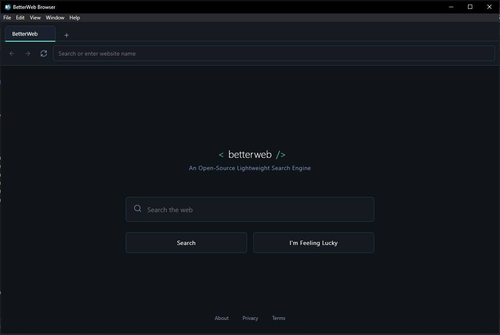

# BetterWeb Browser

  

  A modern, minimalist web browser built with Electron and Chromium.

## ✨ Features

- **Clean, Minimalist Interface**: Dark theme with teal accents for a modern look
- **Google Search Integration**: Seamless search experience with Google
- **Custom Homepage**: Beautiful, distraction-free search page
- **Good Performance**: Light Weight browser that gives really good performance

## 📸 Screenshots

## 🚀 Installation

### Pre-built Binaries

Download the latest release for your platform from the [Releases] page.

## 💻 Usage

### Navigation

- Use the address bar to enter URLs or search queries
- Click the back, forward, and refresh buttons to navigate
- Open new tabs with the + button
- Close tabs with the X button on each tab

## 🔧 Technologies

- **Electron**: Framework for creating native applications with web technologies
- **HTML/CSS/JavaScript**: Core web technologies for the UI
- **Chromium**: Web browser engine that powers the webview components

### Setup Development Environment

## 🤝 Contributing

Contributions are welcome! Please feel free to submit a Pull Request.

1. Fork the repository
2. Create your feature branch (`git checkout -b feature/amazing-feature`)
3. Commit your changes (`git commit -m 'Add some amazing feature'`)
4. Push to the branch (`git push origin feature/amazing-feature`)
5. Open a Pull Request

## 📝 License

This project is licensed under the Apache V2 License - see the [LICENSE](LICENSE) file for details.

## 🙏 Acknowledgements

- [Electron](https://www.electronjs.org/)
- [Brave Browser](https://brave.com/) for design inspiration
- [Google](https://www.google.com/) for search functionality

---

